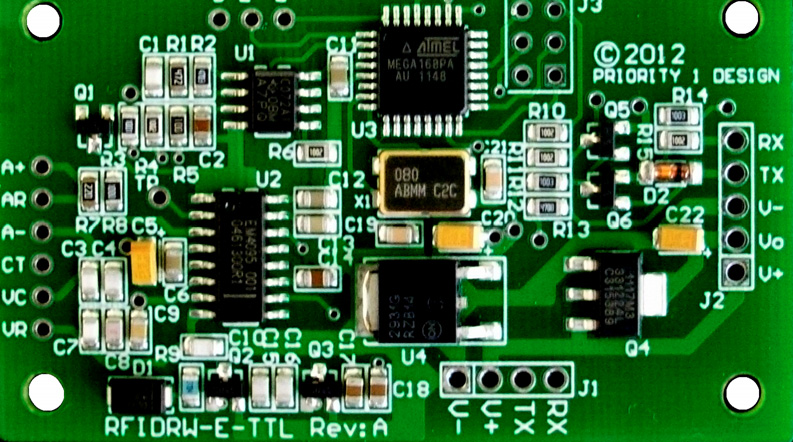
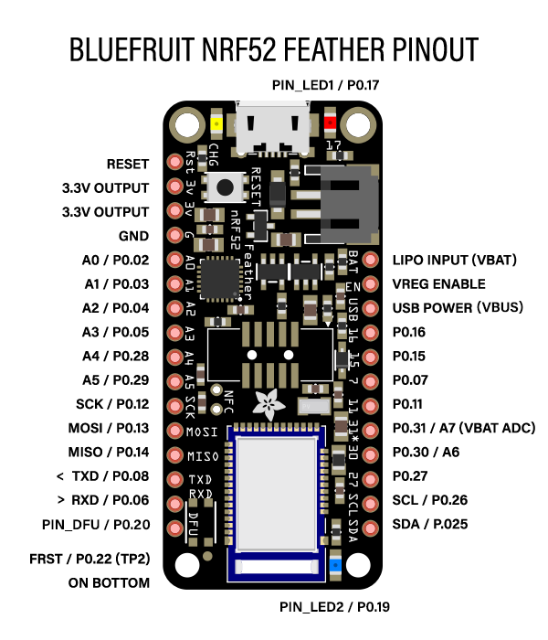

# RFID Library nRF52832
 This is a C Library for the RFIDRW-E-TTL Animal tag and RFID reader writer with external antenna, and TTL output using nRF5 SDK 16.0 (**nRF52832 board**) 

  
  

## How to compile and flash
1. Download:
	
	* gcc arm none eabi toolchain x86-64-linux: https://developer.arm.com/tools-and-software/open-source-software/developer-tools/gnu-toolchain/gnu-rm/downloads
	* SDK for the nRF52 16.0: https://www.nordicsemi.com/Software-and-tools/Software/nRF5-SDK/Download#infotabs
	* Programmer NRFJPROG: https://www.nordicsemi.com/Software-and-tools/Development-Tools/nRF-Command-Line-Tools/Download#infotabs
	* JLink: https://www.segger.com/downloads/jlink/#J-LinkSoftwareAndDocumentationPack

2. Create a folder in /opt to unzip files, e.g. */opt/SEGGER/*
3. Change lines **19**,**20**,**21** and **22** in the *CMakeLists.txt* file at the root project with the path for each one (toolchain,SDK and Programmer) and save it.
	e.g. 

		set(NRF_TARGET 	"nrf52")							  # nrf51 or nrf52
		set(ARM_NONE_EABI_TOOLCHAIN_PATH "/opt/SEGGER/gcc-arm-none-eabi-9-2019-q4-major") # Path to root folder 
		set(NRF5_SDK_PATH "/opt/SEGGER/nRF5SDK"	)					  # Path to root folder
		set(NRFJPROG "/opt/SEGGER/Toolchain/nrfjprog/nrfjprog")				  # Path to .bin file

4. Create a *build* folder and,
	
		$ cd build/	
		$ cmake ../	

	If everything is good, you should see something like this, e.g.

		<info> app: ~~~~~~~~~~~~~~~~~~~~~~~~~~~~~
		<info> app: ***      MAIN PROGRAM     ***
		<info> app: ~~~~~~~~~~~~~~~~~~~~~~~~~~~~~
		<info> app: ---	Setting drv clock:                      DONE
		<info> app: --- Setting drv power:                      DONE
		<info> app: ---	Setting app timer:                      DONE
		<info> app: ---	Setting leds ON:                        DONE
		<info> app: ---	Setting RFID:                           DONE
		<info> app: --- Setting RX pin:                 8
		<info> app: --- Setting TX pin:                 6
		<info> app: ---	Initializing module: 					DONE
		<info> app: --- Flushing TX port: 						DONE
		<info> app: --- Sending command to RFID: 				DONE
		<info> app: --- Command SEND: 					SD0
		<info> app: --- Response from RFID: 			0xOK
		<info> app: --- Flushing TX port:                       DONE
		<info> app: --- Command SEND:                   LTG
		<info> app: --- Response from RFID:             0xOK

		<info> app: --- Flushing TX port:                       DONE
		<info> app: --- Command SEND:                   SL0
		<info> app: --- Response from RFID:             0xOK

		<info> app: --- Flushing TX port:                       DONE

5. Compile with make: (this will compile the source code "main.c" and flash the softdevice.hex and bin.hex to the board)
	
		$ make

	e.g.

		[ 91%] Linking C executable application-example.out
		post build steps for application-example
		   text	   data	    bss	    dec	    hex	filename
		   8800	    172	    884	   9856	   2680	application-example.out
		[ 91%] Built target application-example
		Scanning dependencies of target FLASH_application-example
		[ 93%] flashing application-example.hex
		Parsing hex file.
		Erasing page at address 0x0.
		Erasing page at address 0x1000.
		Erasing page at address 0x2000.
		Applying system reset.
		Checking that the area to write is not protected.
		Programming device.
		Applying system reset.
		Run.
		[ 93%] Built target FLASH_application-example
		Scanning dependencies of target FLASH_SOFTDEVICE
		[ 95%] flashing SoftDevice
		Parsing hex file.
		Erasing page at address 0x0.
		Erasing page at address 0x1000.
		.
		.
		.
		Erasing page at address 0x24000.
		Erasing page at address 0x25000.
		Applying system reset.
		Checking that the area to write is not protected.
		Programming device.
		Applying system reset.
		Run.
		[ 95%] Built target FLASH_SOFTDEVICE
		Scanning dependencies of target FLASH_ERASE
		[ 97%] erasing flashing
		Erasing user available code and UICR flash areas.
		Applying system reset.
		[ 97%] Built target FLASH_ERASE
		Scanning dependencies of target START_JLINK
		[100%] started JLink commands
		[100%] Built target START_JLINK

## How to run monitor
At the root folder run,

		$ ./monitor
		
This assume that the JLink binaries are on */opt/SEGGER/JLink/* if not, you should modify the *runJLinkEXE-nrf52* on the *RTT* folder.

## How to print
Set these variables in your own code

		NRF_LOG_INIT((void*)0);
   		NRF_LOG_DEFAULT_BACKENDS_INIT();   
    		NRF_LOG_PROCESS();              
        	NRF_LOG_INFO("TEXT TO PRINT\n");
        	NRF_LOG_FLUSH();
		
and set these definitions on *sdk_config.h*
    
   		NRF_LOG_BACKEND_RTT_ENABLED 	1
		NRF_FPRINTF_ENABLED 		1
		NRF_FPRINTF_DOUBLE_ENABLED	1
		NRF_LOG_ENABLED 1
		NRF_LOG_BACKEND_UART_BAUDRATE 115200

## How to add new SDK libraries
You have to comment-uncomment these lines in order to include a SDK library in the *CMakeLists.txt* file.

		nRF5x_setup()
		# nRF5x_addAppScheduler()
		# nRF5x_addAppFIFO()
		nRF5x_addAppTimer()
		# nRF5x_addAppUART()
		nRF5x_addAppButton()
		nRF5x_addBSP(TRUE FALSE FALSE) # (btn atn_btn nfc)
		nRF5x_addBLEGATT()
		# nRF5x_addBLEService(ble_bas)
		# nRF5x_addNFC()
		nRF5x_addAppFDS()
		nRF5x_addBLEPeerManager()
		# nRF5x_addBLEAdvertising()
		# nRF5x_addAppFIFO()
		
or,

		include_directories(
			"${NRF5_SDK_PATH}/<library header directory path>"
		)

		list(APPEND SDK_SOURCE_FILES
			"${NRF5_SDK_PATH}/<library source file path>"
		)

BLE SERVICES:

		- ble_ancs_c
		- ble_ans_c
		- ble_bas
		- ble_bas_c
		- ble_bps
		- ble_cscs
		...

## How to use as your own project
Just modify the *main.c* file with your own code. In case you need specify more SDK libraries you have to modify the *nrF5x.cmake* file on the *cmake* folder.

	